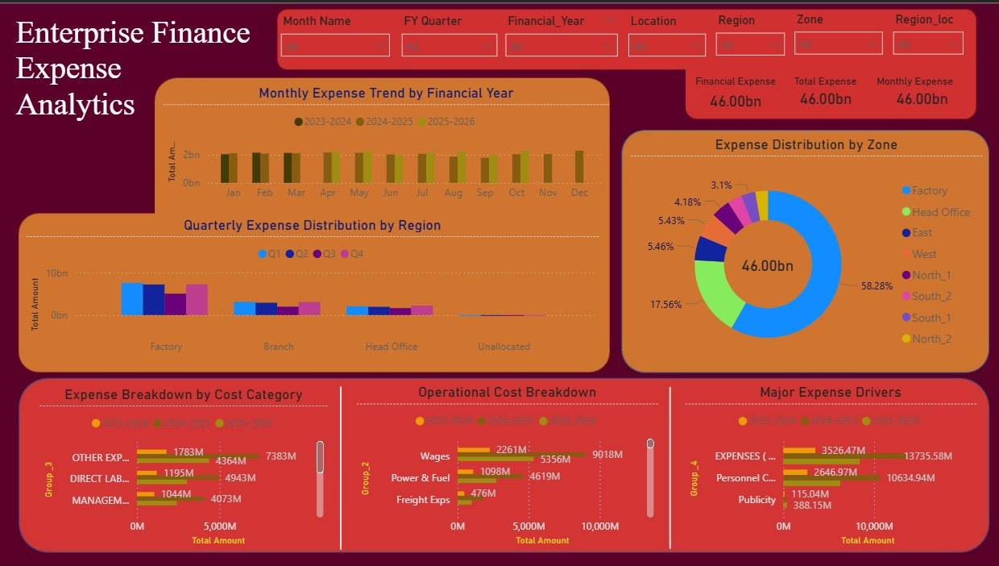

# 📊 Enterprise Finance Expense Analytics Dashboard

## 📌 Project Overview
This project analyzes enterprise financial expense data using **Python for data preparation** and **Power BI for visualization**. The goal of this project is to transform raw financial data into meaningful insights by building an **interactive analytics dashboard**.

The dashboard provides insights into **financial expenses across different regions, zones, locations, and expense categories**, helping stakeholders understand cost distribution, expense trends, and major cost drivers across financial years.

This project demonstrates an **end-to-end data analytics workflow**, including data cleaning, transformation, modeling, and dashboard creation.

---

## 🎯 Objectives
- Analyze enterprise expenses across **financial years and months**
- Identify **major expense drivers**
- Compare **regional and zonal expense distribution**
- Visualize **quarterly financial performance**
- Provide an **interactive dashboard for financial analysis**

---

## 📂 Dataset Columns Used

| Column Name | Description |
|-------------|-------------|
| Year/Month | Financial transaction period |
| Financial_Year | Financial year derived from the date |
| FY Quarter | Quarter of the financial year |
| Month Name | Month of the financial year |
| Location | Office or facility location |
| Region | Business region |
| Region_loc | Regional location grouping |
| Zone | Organizational zone |
| Group_2 | Operational expense category |
| Group_3 | Expense classification |
| Group_4 | High-level expense category |
| Amount | Financial expense value |

---

## ⚙️ Project Workflow

### 1️⃣ Data Collection
The project uses enterprise financial expense data exported from operational systems.

### 2️⃣ Data Cleaning (Python)
Python libraries such as **Pandas and NumPy** were used to:

- Clean and standardize column names  
- Handle missing values  
- Remove duplicate records  
- Convert date formats  
- Create financial year and month fields  

### 3️⃣ Data Transformation
Additional columns were created to support financial analysis:

- Financial Year
- Financial Quarter
- Month Name
- Financial Month Order

These transformations help build **time-based financial analysis**.

### 4️⃣ Data Modeling
The cleaned dataset was structured to support analytical queries and visualization.  
Key relationships were maintained between:

- Financial periods
- Geographic regions
- Expense categories

### 5️⃣ Power BI Dashboard Development

The dashboard includes the following visualizations:

#### 📈 Monthly Expense Trend
Shows expense patterns across months and financial years.

#### 📊 Regional Expense Analysis
Compares financial expenses across different regions and quarters.

#### 🍩 Zone Distribution
Displays the proportion of total expenses across organizational zones.

#### 📉 Expense Category Breakdown
Analyzes operational and administrative cost categories.

#### 📊 Cost Driver Identification
Identifies major contributors to enterprise expenses.

---

## 📊 Dashboard Features
- Interactive slicers for **Month, Financial Year, Location, Region, and Zone**
- KPI cards showing **Total Expense and Monthly Expense**
- Visual comparison across **regions and expense groups**
- Hierarchical expense analysis

---

## 🛠️ Tools & Technologies

- **Python**
- **Pandas**
- **NumPy**
- **Power BI**
- **DAX**
- **Data Visualization**
- **Data Cleaning & Transformation**

---

## 📷 Dashboard Preview

---

## 🚀 Key Insights
- Identified **major enterprise cost drivers**
- Compared **regional expense distribution**
- Analyzed **financial trends across months and quarters**
- Highlighted **zone-wise expense contributions**

---

## 👨‍💻 Author

**Aritra Banerjee**

- Aspiring Data Analyst skilled in **Python, Data Analysis, and Power BI Dashboard Development**
---
